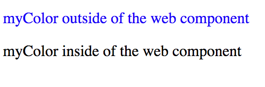
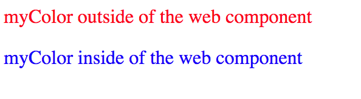

# Webpack web component css

This demo shows that is currently not possible to add a CSS file reference into
a Web Component imported by webpack when using the extract css and html plugin.

An imported css file is added automatically to the body.
For web components it is imported that the css file is linked inside the shadow DOM.

I didn't include a polyfill, so this demo will run only in Chrome.

## Result

**This is what we get:**

`myWebComponent.css` is bundled into the css file of the apps body.

`.myColor` of `myWebComponent.css` overwrites `app.css`.

The text-color of the web component is still black, because the CSS is scoped from the shadow DOM.

**This is how it should look like,** if `myWebComponent.css` would be linked inside of `<my-component>`

